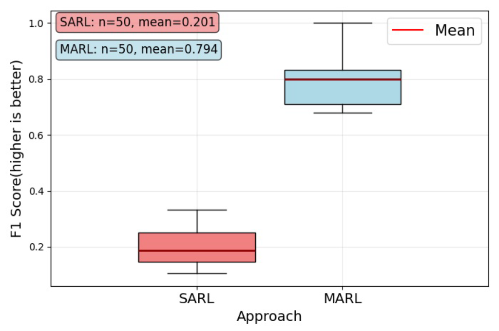
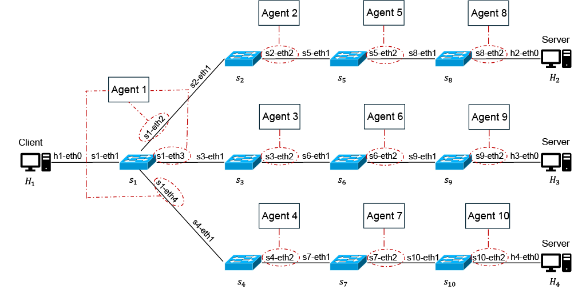
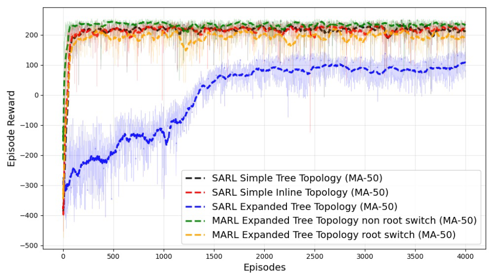
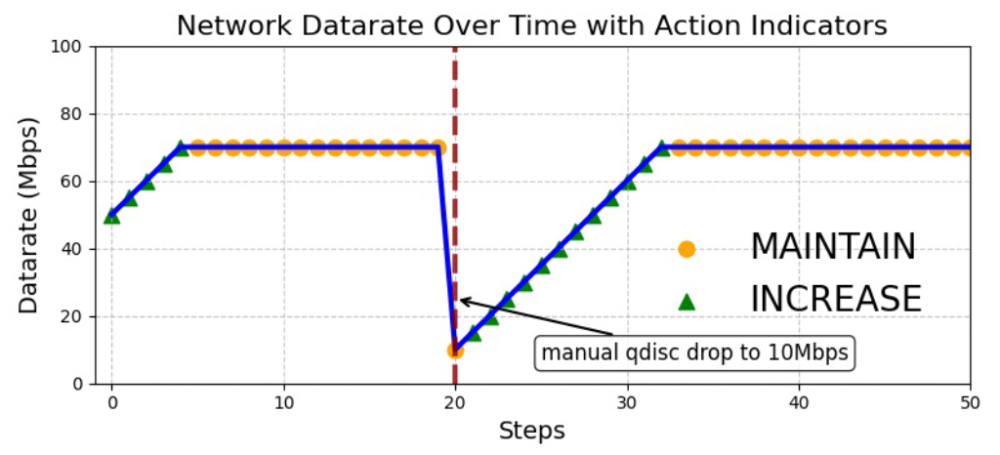

# Multi-Agent Reinforcement Learning for Network QoS Optimization

A Multi-Agent Reinforcement Learning (MARL) system that dynamically controls
qdisc rates across a 10-switch tree topology with a high-dimensional action
space, to maximize network throughput under simulated network incidents.

> **Note:** This repository contains the MARL training code for the Expanded
> Tree Topology. Additional topologies (SARL, Simple Tree, Simple Inline) were
> evaluated as part of the Bachelor's thesis but are not included here.
> Full reproduction requires a configured Mininet environment on Ubuntu 22.04
> ARM64. Results shown are from a single-seed evaluation (50 test runs with
> varying incident probabilities).

---

## Problem Statement

Networks are growing increasingly complex, especially with the rise of IoT,
which makes them harder to manage with static, manually engineered rules.
Reinforcement Learning is a natural fit for this kind of adaptive control
problem, but training RL agents directly on real networks is impractical —
training requires many trial-and-error episodes, and real-world failures are
costly.

This project sidesteps that problem using a **Digital Twin (DT)**: a
network environment built with Mininet, iperf, and Linux traffic-control
tools (`ip`, `tc qdisc`) that mirrors real network behavior closely enough to
train an RL agent safely. The agent's task is to adjust the data rate of
each qdisc in response to incoming traffic and simulated incidents (arbitrary
manual qdisc drops). Both Single-Agent RL (SARL) and Multi-Agent RL (MARL)
are compared with respect to scalability and credit assignment, across
topologies of increasing complexity and action space size.

*Context: developed as part of a Bachelor's thesis at the Technical
University of Munich (TUM), Chair of Network Architectures and Services.*

---

## Key Result

**MARL substantially outperforms single-agent SARL** on incident detection and
throughput recovery on the expanded tree topology (F1-Score: 0.794 vs. 0.201,
single-seed evaluation, n=50 test runs with varying incident probabilities).



**Why:** A single SARL agent has to handle the full, combined action and
observation space of all 10 switches through one centralized reward signal —
this makes it hard to localize *which* interface actually experienced a qdisc
drop, so learning is inefficient. MARL splits the action and observation space
across 10 independent agents, each receiving its own reward, which makes
localizing and responding to drops on a specific interface substantially
easier.

---

## System Architecture

The system models an expanded tree topology with 1 root switch (s1) and
9 leaf switches (s2–s10), each controlled by an independent PPO agent.



| Component | Description |
|---|---|
| Agent 1 (Root) | Controls s1-eth2, s1-eth3, s1-eth4 — upstream interfaces |
| Agents 2–10 (Leaf) | Each controls one downstream interface |
| Training order | Hierarchical: root agent trained first, leaf agents second |
| Action space | INCREASE / MAINTAIN / DECREASE qdisc rate per interface |
| Reward | Balances maximizing throughput, minimizing packet loss, and minimizing rate fluctuation |
| State space | Current data rate, previous action, incident flag per interface |

---

## Training Convergence

MARL (root + leaf agents) converges substantially faster than SARL on the
expanded tree topology, reaching stable rewards within a few hundred episodes
versus several thousand for SARL (single-seed evaluation).



---

## Agent Behavior — Throughput Recovery

After a manual qdisc drop to 10 Mbps at step 20, the trained agent detects the
incident and recovers throughput to ~70 Mbps using consecutive INCREASE
actions.



---

## Tech Stack

| Component | Technology |
|---|---|
| RL Algorithm | PPO (Proximal Policy Optimization) |
| RL Library | Stable Baselines3 |
| Environment | Custom OpenAI Gym environment |
| Network Simulation | Digital Twin built with Mininet, iperf, and Linux traffic-control tools (`ip`, `tc qdisc`) |
| Language | Python 3 |
| Logging | CSV-based episode logging with custom callbacks |

---

## Project Structure

```
├── marl_expanded_tree_topology_simulation.py  # Main MARL training script
├── requirements.txt                           # Python dependencies
├── results/                                   # Evaluation plots
│   ├── topology.png                           # Network topology diagram
│   ├── training_reward_curves.png             # Reward convergence plot
│   ├── throughput_recovery.png                # Agent behavior under incident
│   └── marl_vs_sarl_f1_score.png              # MARL vs SARL comparison
└── README.md
```

---

## Setup

Tested on Ubuntu 22.04 ARM64 (VM on Apple Silicon).

```bash
git clone <repo-url>
cd marl-network-optimization
pip install -r requirements.txt
```

---

## Run

```bash
# Simulation mode (no Mininet required)
python marl_expanded_tree_topology_simulation.py --mode simulation

# Full pipeline: training + behavior testing
python marl_expanded_tree_topology_simulation.py --mode both
```

---

## Results Summary

MARL outperformed SARL on the expanded tree topology across both metrics
evaluated: it converged in substantially fewer training episodes and
recovered throughput faster and more completely after simulated qdisc drops.
These results support the thesis' broader finding that MARL scales better
than SARL as topology complexity and action space size increase.
